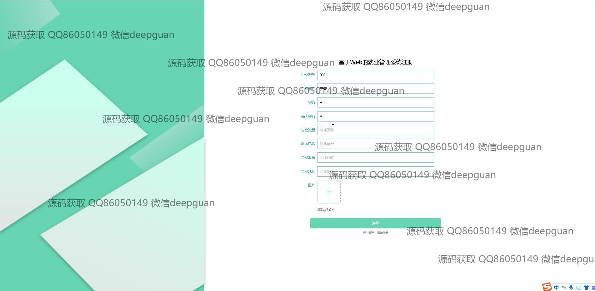
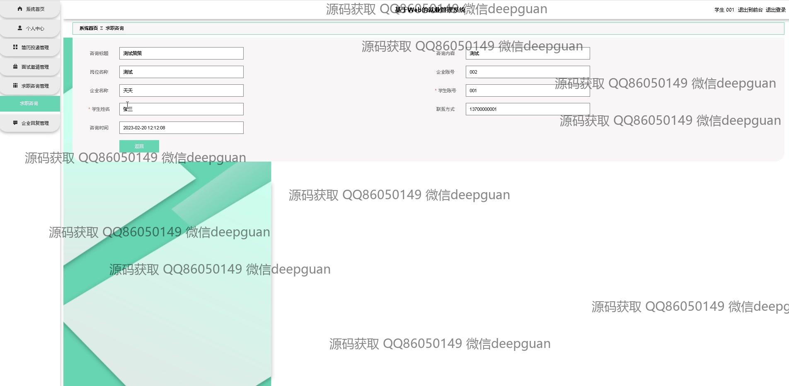

<h1 align="center">基于Web的就业管理系统</h1>

## 简介
基于Spring Boot的Web就业管理系统，角色分为管理员、企业和学生用户；提供企业注册、招聘信息管理、简历管理、面试安排、求职咨询等功能，支持用户互动和高效的数据管理。    --计算机毕业设计源码；毕设源码；java毕业设计源码

## 联系方式

<h3 align="center">获取完整代码与数据库文件 + 微信：deepguan QQ: 86050149 QQ群: 783742310</h3>

<h3 align="center">可帮忙远程部署 包运行成功！提供远程部署、修改代码、设计文档指导、代码讲解等服务！</h3>

## 功能介绍（完整见运行截图）
管理员：基本功能包括管理员身份的登录和注册，提供系统管理模块的访问权限。系统首页拥有主要导航栏，链接至学生管理、企业管理、招聘信息管理、人才库管理、简历管理、求职咨询和面试邀请等模块。管理员可以在企业管理中查看、修改和删除企业信息；在招聘信息管理中，可以审核、查看和编辑招聘信息；在人才库管理中，可以查看和管理学生信息，编辑简历以及处理求职相关事宜。

企业用户：企业用户可以通过专门设计的企业注册页面进行注册，注册后可使用企业账号登录系统。企业用户还可以发布和管理招聘信息，通过招聘管理模块进行职位发布，编辑招聘职位详情等，包括职位名称、工作地点和行业类型。此外，企业用户可以审核收到的简历，检视面试邀请和与求职者的互动记录。

学生用户：学生用户通过注册功能可以建立个人账户，注册时需要填写相关信息如姓名、性别、年龄、联系方式等。登录后，学生可以浏览最新的招聘信息，在线申请职位，并上传自己的简历。也可以在个人中心查看和管理个人信息，修改简历和查看求职进展，包括查看面试邀约以及回复企业消息。

求职者：求职者不仅包括已注册的学生，也包括非注册用户对职位信息的查看。系统允许求职者通过导航栏进入职位浏览页面，查看详细企业信息和招聘公告。求职者可以通过留言板功能获取面试建议，使用搜索及筛选功能更快捷地找到对应的职位。系统还支持求职者在求职咨询界面上传相关资料，便于与企业之间的沟通。

## 运行截图

本代码来源于网络,仅供学习参考使用!

